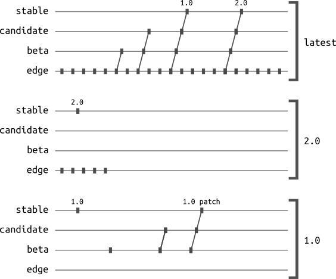

The tracks and channels mechanism provided by the store allow you to distribute multiple versions of the same snap, allowing users to follow and get automated upgrades for daily releases (published manually or automatically [through Launchpad or Travis](/docs/build-snaps/ci-integration)), beta, candidate and stable releases. It also provides a way for your users to stick to a specific software series and benefit from fixes for this series.

## Tracks

Tracks allow you to publish different series of your software and let users stick to a specific release.

* By default, snaps are published to a track called `latest`. This is also the default for users when they install a snap.
* In each track, you can publish your snap in the following channels: `stable`, `candidate`, `beta` and `edge`.
* Users do not get automatically moved between tracks: it is a conscious decision to not install snaps from the `latest` track and it's conscious decision to move back to it or to any other track.

As of now, you can [ask store developers](/community), to open a new track for your snap.

### Example

The most common use case for opening a new track is to host a previous stable release for users to install.

Eg. when you release the 2.0 version of your software in the `latest` track, opening a track called `1.0` for users wanting to stay on 1.0.

## Channels

There are four risk-based channels available for your snaps, that denote the stability of your software.

By default, snaps are installed from the `stable` channel.

* `stable`: what most users will consume and as the name suggests, should be your most polished, stable and tested versions. Snaps in this channel appear in user searches.
* `candidate`: used to vet uploads that should require no further code changes before moving to stable.
* `beta`: used to provide preview releases of tested changes.
* `edge`: for your most recent changes, probably untested and with no guarantees attached.

Make sure you follow these guidelines, as they have an impact of visibility of snaps in search results.

### Channels restrictions: confinement and grade

In your [`snapcraft.yaml`](/docs/build-snaps/syntax), you can declare the development status of your snap with the `grade` keyword and its confinement policy with the `confinement` one.

Depending on these, your snap can be restricted to certain channels.

|                 | `confinement: strict`  | `confinement: classic` | `confinement: devmode` |
| --------------- | ---------------------- | ---------------------- | ---------------------- |
| `grade: stable` | *all* channels         | *all* channels         | `beta` and `edge` only |
| `grade: devel`  | `beta` and `edge` only | `beta` and `edge` only | `beta` and `edge` only |

## Command-line usage

When using tracks and channels from the command-line, when track or channel is omitted, `latest` or `stable` is assumed.

### Releasing a snap

To release a snap revision to a track, the format to use is:

    snapcraft release <snap> <revision> <track/channel>

#### Examples

* Releasing revision 12 of a my-app snap to the beta channel of the latest track:

         $ snapcraft release my-app 12 latest/beta
      Or $ snapcraft release my-app 12 beta

* Releasing revision 12 of a my-app snap the stable channel of the 1.0 track:

         $ snapcraft release my-app 12 1.0/stable
      Or $ snapcraft release my-app 12 1.0

### Installing a snap

To install a snap from a specific track, the format to use is:

       snap install <snap> --channel=<track/channel>
    Or snap install <snap> --<channel>

#### Examples

* Installing the latest stable version of my-app:

         $ snap install my-app
      Or $ snap install --stable
      Or $ snap install --channel=latest/stable

* Installing the beta version of my-app from the 1.0 track:

       $ snap install my-app --channel=1.0/beta
